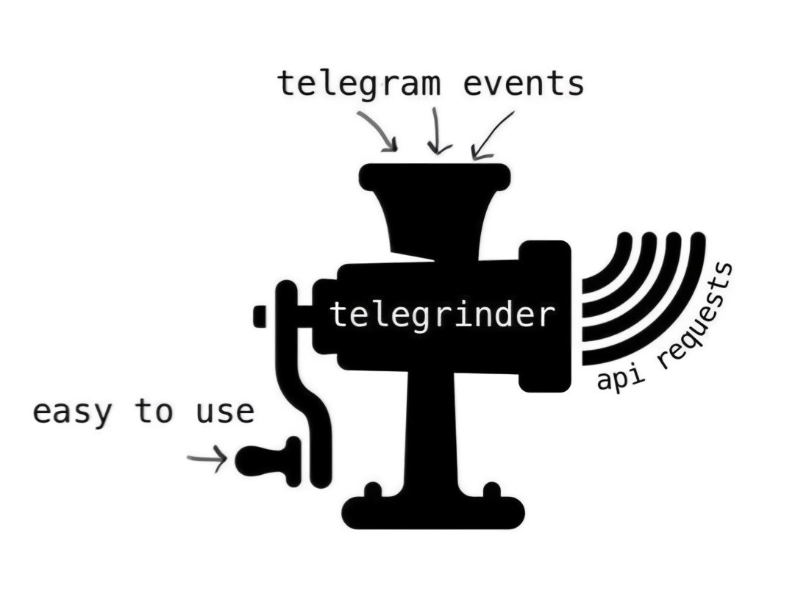

<p align="center">
  <a href="https://github.com/timoniq/telegrinder">
    
  </a>
</p>

</p>
<h1 align="center">
  Telegrinder
</h1>

<p align="center">
    <em><b>Framework for effective and reliable telegram bot building.</b></em>
</p>

<p align="center">
  <a href="https://github.com/timoniq/telegrinder/actions/workflows/ci.yml">
    
  </a>
  <a href="https://github.com/timoniq/telegrinderblob/main/LICENSE">
    
  </a>
  <a href="https://pypi.org/project/telegrinder/">
    
  </a>
  <a href="https://docs.astral.sh/ruff/">
    
  </a>
  <a href="https://pypi.org/project/telegrinder/">
    
  </a>
  <a href="https://core.telegram.org/bots/api">
    
  </a>
</p>


_Still in development._

* Type hinted
* Customizable and extensible
* Ready to use scenarios and rules
* Fast models built on [msgspec](https://github.com/jcrist/msgspec)
* Both low-level and high-level API
* Support [optional dependecies](https://github.com/timoniq/telegrinder/blob/dev/docs/guide/optional_dependencies.md)


# Getting started

Install using pip, uv and poetry:

```console
pip install telegrinder
```

```console
poetry add telegrinder
```

```console
uv add telegrinder
```

Install from [source](https://github.com/timoniq/telegrinder):

```console
pip install git+https://github.com/timoniq/telegrinder/archive/dev.zip
```

```console
uv add "telegrinder @ git+https://github.com/timoniq/telegrinder.git@dev"
```

```console
poetry add git+https://github.com/timoniq/telegrinder.git#dev
```

Basic example:

```python
from telegrinder import API, Message, Telegrinder, Token
from telegrinder.modules import logger
from telegrinder.rules import Text

logger.set_level("INFO")
api = API(token=Token("123:token"))
bot = Telegrinder(api)


@bot.on.message(Text("/start"))
async def start(message: Message) -> None:
    me = (await api.get_me()).unwrap()
    await message.answer(f"Hello, {message.from_user.full_name}! I'm {me.full_name}.")


bot.run_forever()
```

# Documentation

[Readthedocs](https://telegrinder.readthedocs.io)

# Community

Join our [telegram forum](https://t.me/botoforum).

# [Contributing](https://github.com/timoniq/telegrinder/blob/main/contributing.md)

# License

Telegrinder is [MIT licensed](./LICENSE)\
Copyright © 2022-2025 [timoniq](https://github.com/timoniq)\
Copyright © 2024-2025 [luwqz1](https://github.com/luwqz1)

# Contributors


<a href="https://github.com/timoniq/telegrinder/graphs/contributors">
 
</a>
